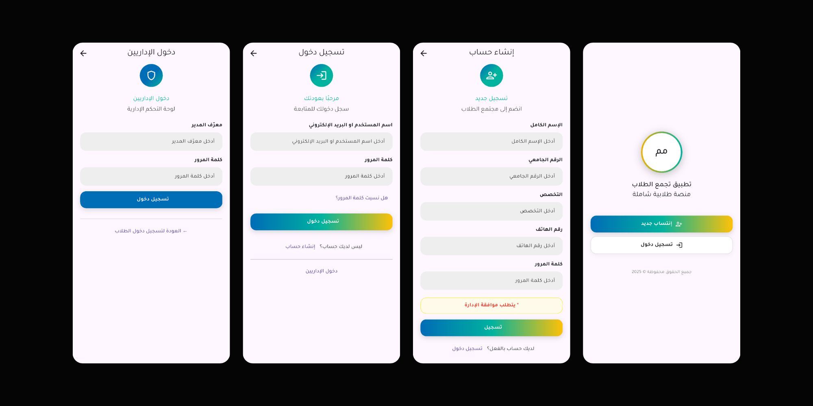
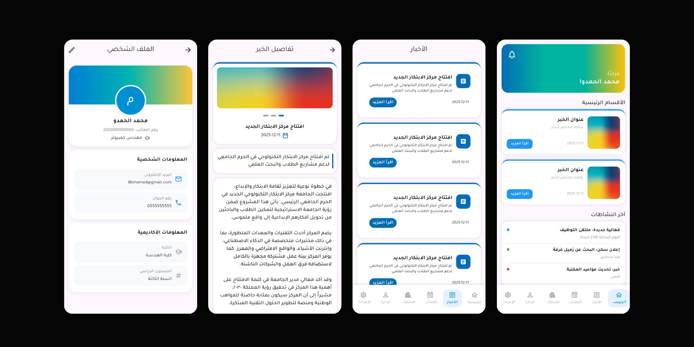
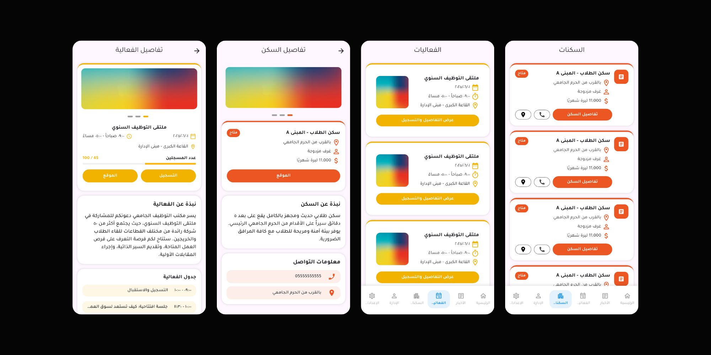

# Syrian Students Gathering App

## About:
This repository contains the source code for the user interface (UI) design of the **Syrian Students Gathering in Konya** application.
The interfaces were built entirely using the **Figma** design framework, with a focus on clean, scalable code and a focus on user experience (UX).
**Note:** This project covers only the frontend and does not include backend integration.

## Screenshots:

